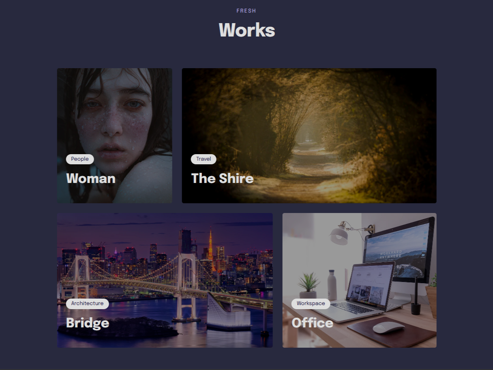
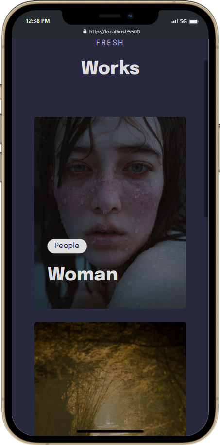

<h1 align=center > Works Gallery </h1>

<strong>Works Gallery</strong> tem como objetivo <em>destacar trabalhos recem feitos</em> de uma determinada entidade

 

 
  

 

## 🧠 <strong>TECNOLOGIAS</strong>

 

 Tecnologias usadas na criação deste projeto:

- HTML
- CSS
- Figma

 

## 👨‍💻 <strong>PROJETO</strong>

 

**📲MOBILE FIRST**

Foi utilizado o metodo <em>mobile first</em>, tendo enfase primeiro na portabilidade do projeto para celulares.

 

  

 

**👋 ANIMAÇÕES DE INÍCIO E IMAGENS INTERATIVAS**

 

- <a href="https://kauanespindula.github.io/works-gallery" target="_blank">Visite o projeto online aqui!</a>

## **📑Layout**

 

Você pode acessar o layout no figma através [DESSE LINK](https://www.figma.com/file/sKWePDyLi3TtGphphy6tYk/Explorer-Stage-03-Projeto-03/duplicate). Para sua Visualização é necessario ter conta no [Figma](https://www.figma.com/).
